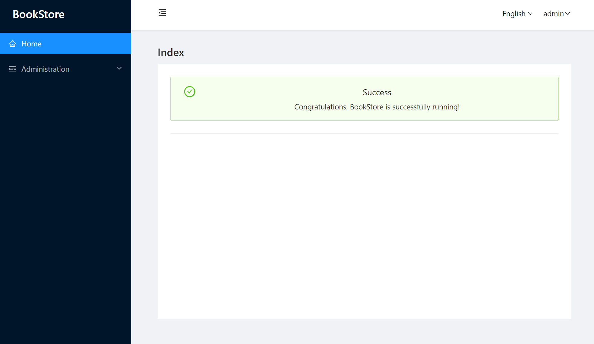

The first step is to use ABP CLI to create a new project.

`abp new BookStore -u blazor-server -t app`

> See the [ABP official documentation](https://docs.abp.io) to learn [ABP framework](https://github.com/abpframework/abp).

**Replace LeptonXLiteTheme with AntBlazorTheme packages**

* Replace `Volo.Abp.AspNetCore.Components.Server.LeptonXLiteTheme` with `Lsw.Abp.AspnetCore.Components.Server.AntDesignTheme`
* Replace `Volo.Abp.Identity.Blazor.Server` with `Lsw.Abp.IdentityManagement.Blazor.Server.AntDesignUI`
* Replace `Volo.Abp.SettingManagement.Blazor.Server` with `Lsw.Abp.SettingManagement.Blazor.Server.AntDesignUI`
* Replace `Volo.Abp.TenantManagement.Blazor.Server` with `Lsw.Abp.TenantManagement.Blazor.Server.AntDesignUI`
* Replace `Volo.Abp.FeatureManagement.Blazor.Server` with `Lsw.Abp.FeatureManagement.Blazor.Server.AntDesignUI`

```

**Open `_Imports.razor` and add with the following:**

```csharp
@using AntDesign
@using Lsw.Abp.AntDesignUI
@using Lsw.Abp.AntDesignUI.Components
@using Lsw.Abp.AspnetCore.Components.Web.AntDesignTheme.Layout
@using Lsw.Abp.AspnetCore.Components.Web.AntDesignTheme.Bundling
```

**Open `BookStoreBlazorModule` make the following changes:**

* Remove the `ConfigureBlazorise` method
* Fix wrong using namespace
* Update module dependencies
    * For example, replace `AbpIdentityBlazorServerModule` with `AbpIdentityBlazorServerAntDesignModule`

**Open `BookStoreMenuContributor` to update icon:**

* `"fas fa-home"` to `IconType.Outline.Home`
* `"fa fa-cog"` to `IconType.Outline.Setting`

**Remove all Blazorise packages.**

**Replace `BlazorLeptonXLiteThemeBundles` with `BlazorAntDesignThemeBundles`**

**Open `Index.razor` and replace with the following:**

```csharp
@page "/"
@inherits BookStoreComponentBase

<AbpPageHeader Title="Index"></AbpPageHeader>

<div class="page-content">
    <div style="text-align: center">
        
        <Alert Type="@AlertType.Success"
               Message="Success"
               Description=" Congratulations, BookStore is successfully running!"
               ShowIcon="true"/>

        <Divider/>

    </div>
</div>
```

**Open `Routes.razor` and replace with the following:**

```csharp
@using Lsw.Abp.AspnetCore.Components.Web.AntDesignTheme.Routing
@using Lsw.Abp.AspnetCore.Components.Web.AntDesignTheme.Themes.AntDesignTheme
@using Microsoft.Extensions.Options
@inject IOptions<AbpRouterOptions> RouterOptions

<Router AppAssembly="typeof(Program).Assembly" AdditionalAssemblies="RouterOptions.Value.AdditionalAssemblies">
    <Found Context="routeData">
        <AuthorizeRouteView RouteData="routeData" DefaultLayout="typeof(DefaultLayout)">
            <NotAuthorized>
                <RedirectToLogin />
            </NotAuthorized>
        </AuthorizeRouteView>
    </Found>
</Router>
```

Run the `dotnet build` & `abp bundle` command in the `BookStore.Blazor` folder.

That's all, enjoy your code :).

