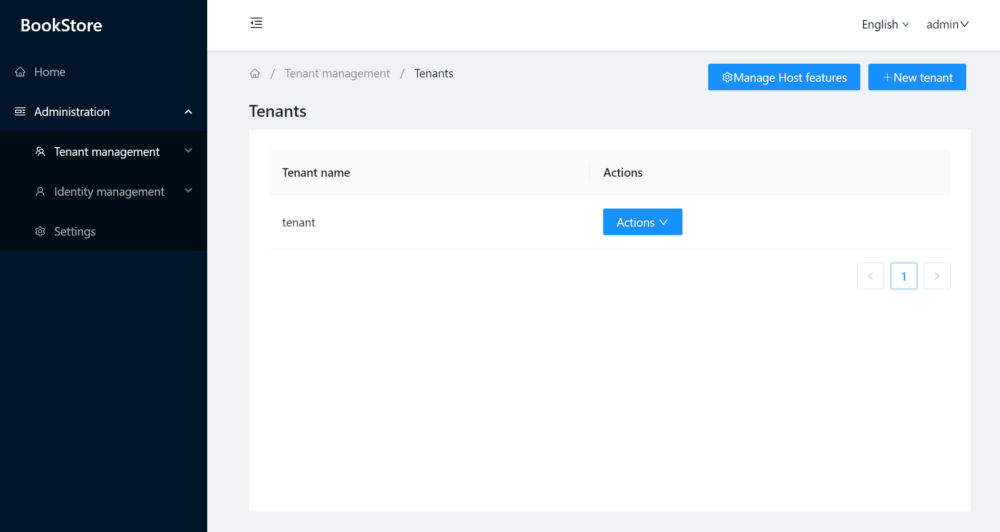
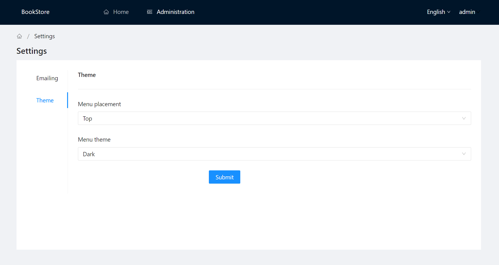

# Lsw.Abp.AntDesignUI

**An Abp Blazor Theme based [Ant-Design-Blazor](https://github.com/ant-design-blazor/ant-design-blazor) !**

## Samples

* [Blazor WebApp sample](/samples/BookStoreWebApp/)
* [BLazor WebAssembly and Blazor server samples](/samples/BookStore/)

## Quick Start

[Change the theme of the ABP project to AntBlazorTheme for Blazor WebApp.](./README.WebApp.md)

[Change the theme of the ABP project to AntBlazorTheme for Blazor.](./README.Blazor.md)

## Road map

Updating...
