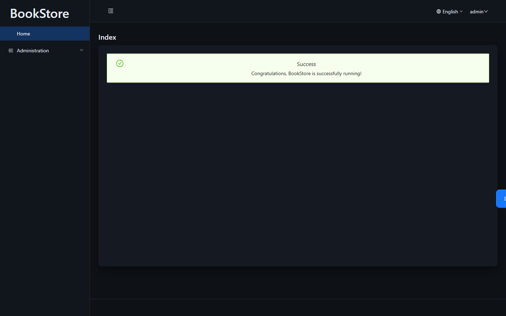
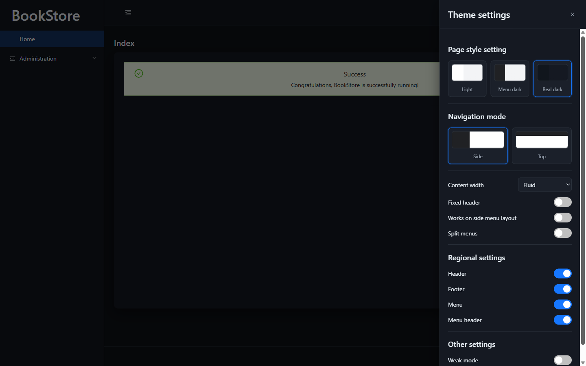

# Lsw.Abp.AntDesignUI

ABP Blazor UI theme and module set based on [Ant Design Blazor](https://github.com/ant-design-blazor/ant-design-blazor).

## Features

Lsw.Abp.AntDesignUI provides an Ant Design Pro-style application shell for ABP Blazor applications.

- Refactored application layout with side and top navigation.
- Responsive sidebar behavior for desktop and mobile screens.
- Light, menu-dark, and real-dark visual styles.
- Runtime controls for content width, fixed header, fixed sidebar, split menus, and page regions.
- Floating theme settings panel for authenticated users.
- Admin-managed theme setting availability through ABP Setting Management.
- AntDesign UI implementations for common ABP management modules.

## Theme Settings

Authenticated users can open the settings panel from the right side of the application and change the layout without restarting the app.

The panel includes:

- Page style selection.
- Navigation mode selection.
- Content width and fixed layout switches.
- Header, footer, menu, and menu header visibility.
- Weak color mode.

Administrators can choose which groups are visible from `Administration -> Settings -> Theme settings management`.

## Screenshots

## Samples

- [WebApp (Auto mode)](./samples/WebApp/)
- [WebApp Blazor Server](./samples/WebAppBlazorServer/)
- [WebApp Blazor WebAssembly](./samples/WebAppBlazorWebAssembly/)

Sample login:

- Username: `admin`
- Password: `1q2w3E*`

## Usage Guides

- [Use AntDesign theme in ABP Blazor WebApp](./README.WebApp.md)
- [Use AntDesign theme in ABP Blazor Server](./README.BlazorServer.md)
- [Use AntDesign theme in ABP Blazor WebAssembly](./README.BlazorWebAssembly.md)
